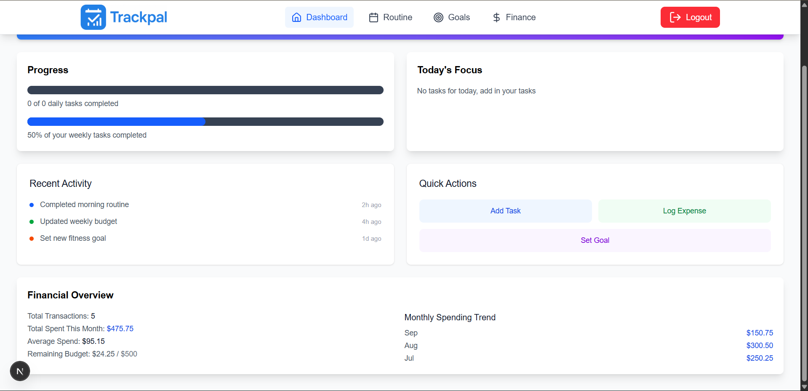
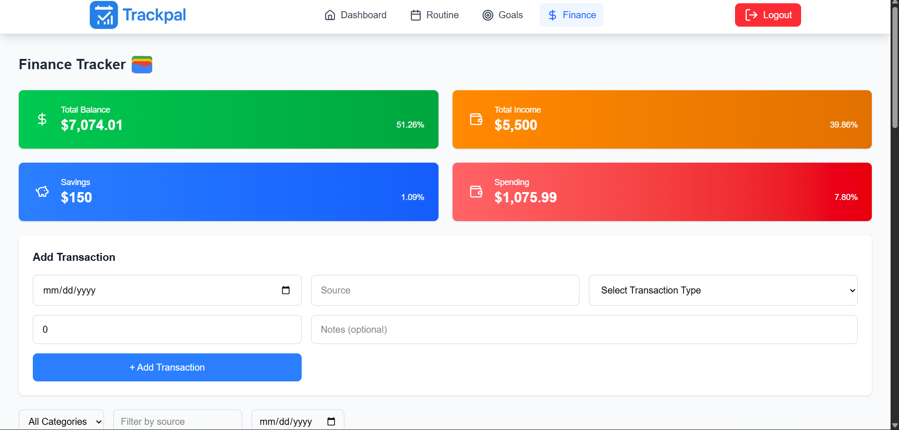
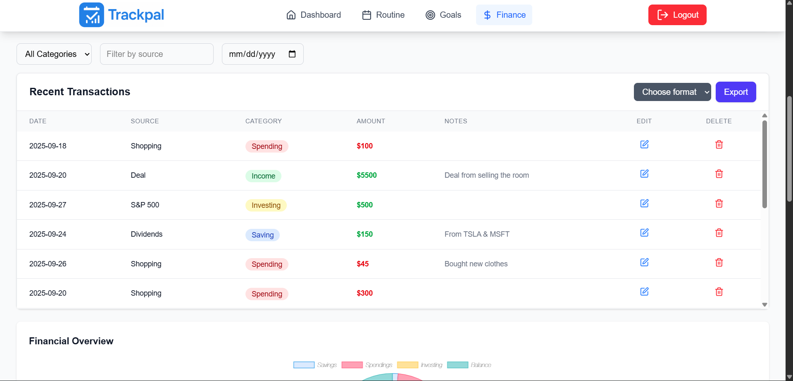
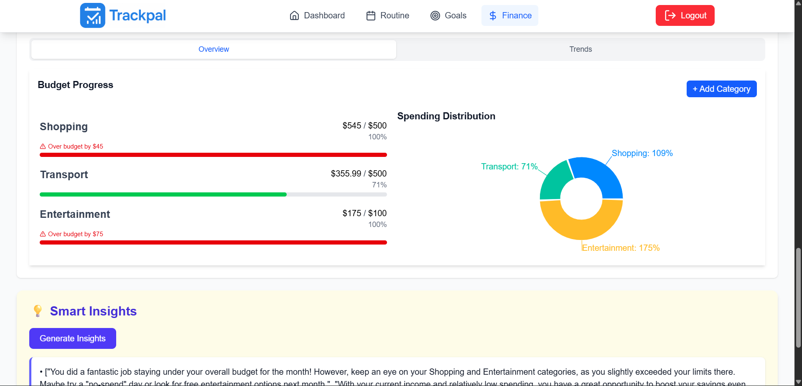
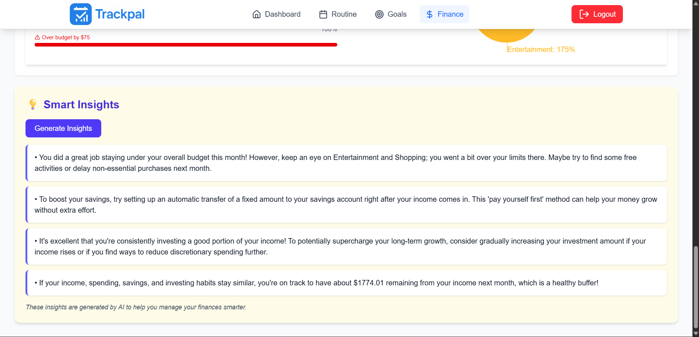

# TrackPal

## Overview

TrackPal is a comprehensive productivity and finance tracking application designed to help users manage their daily tasks, weekly goals, and personal finances efficiently. Available as a web application and an Android mobile app, TrackPal empowers students, young professionals, and anyone interested in optimizing their daily routines and financial health. The app features intuitive tracking tools, visualizations, and AI-powered insights to streamline personal development and money management.

Deployed live at: [trackpal.vercel.app](https://trackpal.vercel.app)

## Features

TrackPal offers a suite of features tailored for productivity and financial oversight:

### Daily Task Tracking
- Tasks are categorized into four main areas: **Growth** (e.g., learning new skills), **Health** (e.g., exercise, nutrition), **Core** (e.g., work or study essentials), and **Leisure** (e.g., hobbies, relaxation).
- Users can add, edit, check off, and delete tasks.
- Visual progress indicators for each category to monitor daily completion.

### Weekly Goals Tracker
- Set and track weekly goals with associated tasks.
- Goals are automatically categorized by status:
  - **Not Started**: No tasks checked.
  - **In Progress**: At least one task checked.
  - **Done**: All tasks checked.
- Streak system to display consecutive weeks where all goals are completed, encouraging consistency.
- Progress bars and notifications for goal advancement.

### Finance Tracker
- **Transaction Management**: Add transactions with details including date, source, category (e.g., Spending, Income, Investing, Saving), amount, and optional notes. Edit or delete entries as needed.
- **Financial Overview**: Displays total balance, income, savings, and spending with percentage breakdowns. Includes pie charts for distribution across categories like Balance, Spending, Investing, and Savings.
- **Budgeting Tools**: Set monthly budgets per category (e.g., Shopping, Transport, Entertainment). Track progress with progress bars, warnings for over-budget scenarios, and remaining amounts.
- **Spending Distribution**: Pie charts showing percentage allocation across spending categories.
- **Export Options**: Export financial stats and analytics as CSV or PDF for reporting and analysis.
- **Smart Insights**: AI-generated recommendations and tips based on your data, such as budget advice, saving strategies, and projections (e.g., "You did a great job staying under your overall budget this month!"). Generate insights on-demand.
- Recent transactions table with filtering by category, source, or date.

All data is stored securely, with email notifications for key events (e.g., budget alerts) powered by Resend.

## Target Audience

TrackPal is ideal for:
- Students managing study schedules and part-time finances.
- Young professionals balancing career growth and expenses.
- Individuals seeking to track daily habits, set achievable goals, and maintain financial discipline.

## Tech Stack

- **Frontend**: Next.js, React, Tailwind CSS, Chart.js (for visualizations).
- **Backend/Database**: Supabase (for authentication, storage, and real-time data).
- **Mobile**: Capacitor (for Android app build), TypeScript.
- **Other**: Resend (email services), Vercel Cron Jobs (scheduled tasks).

## Installation and Local Setup

### Prerequisites
- Node.js (v18 or higher)
- npm or yarn
- Android Studio (for Android build)
- Supabase account (for database setup)
- Environment variables: Create a `.env.local` file with keys for Supabase (e.g., `SUPABASE_URL`, `SUPABASE_ANON_KEY`), Resend API key, etc.

### Running the Web App Locally
1. Clone the repository:
git clone https://github.com/lionzak/TrackPal.git
cd trackpal
2. Install dependencies:
npm install
3. Start the development server:
npm run dev
The app will be available at `http://localhost:3000`.

### Building and Running the Android App Locally
1. Ensure the web app is built:
npm run build
2. Add Capacitor:
npx cap add android
3. Sync the web assets to Android:
npx cap sync
4. Open in Android Studio:
npx cap open android
5. Build and run the app in Android Studio or via CLI:
npx cap run android
Note: Ensure Capacitor plugins (e.g., for storage, notifications) are configured in `capacitor.config.ts`.

## Deployment

- **Web**: Deployed on Vercel. Simply connect your GitHub repo to Vercel and deploy.
- **Android**: Build APK using Capacitor and deploy to Google Play Store.

## Screenshots

  

  

  

  

  

## Minimal Report
[TrackPal Impact Report](/report.html)

## Contributing

Contributions are welcome! Please fork the repo, create a feature branch, and submit a pull request. Ensure code follows ESLint rules and tests pass.

## License

MIT License. See [LICENSE](LICENSE) for details.
